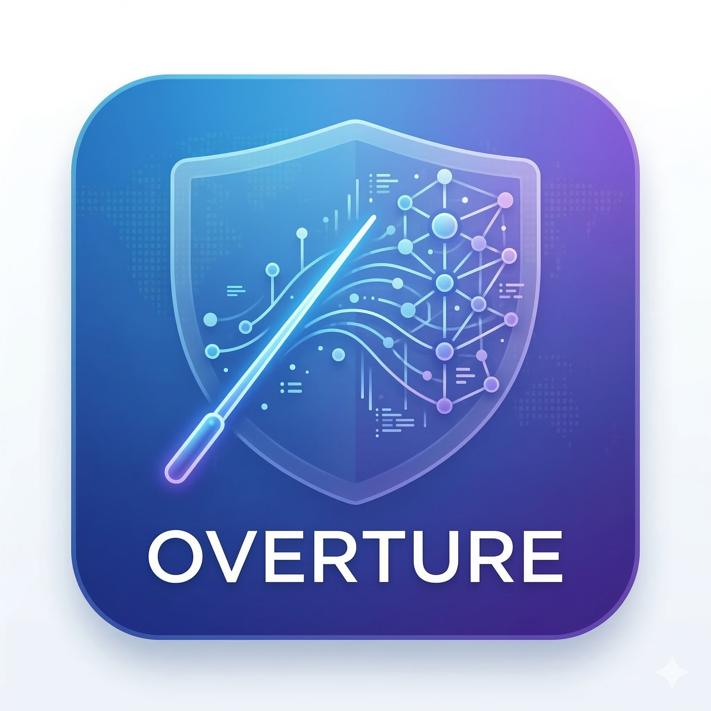

<p align="center">
  
</p>

# Overture

Overture is a local-first AI delivery control plane. It takes a deep-research markdown blueprint, runs a real Codex planning pass to turn that document into milestones, epics, and execution tickets, mirrors that graph through a Linear-compatible tracker surface, and launches Symphony as the autonomous execution runtime.

The current app is a working Next.js control plane with SQLite persistence, real LLM-backed plan ingestion, vendored Symphony orchestration, artifact storage, gate tracking, runtime observability, project deletion, and a settings area for model/runtime defaults.

## What the platform does

- Ingests deep-research markdown plans
- Uses Codex to produce a structured execution model
- Generates milestones, epics, dependency edges, findings, runs, artifacts, and audit events
- Injects mandatory QA, security, deployment, observability, documentation, and release gates
- Exposes a Linear-compatible tracker GraphQL surface for Symphony polling
- Launches Symphony against a per-project workflow contract
- Tracks gate readiness, runtime state, artifacts, findings, and audit history in the UI
- Supports hard deletion of failed or stale projects from the dashboard and project page
- Lets users choose planner and execution model defaults plus Codex thinking levels in `/settings`, with per-project overrides available in the intake flow

## Runtime model

There are two supported execution modes:

- `local_chatgpt`: uses the local Codex runtime already authenticated on the machine running Overture
- `hosted_api`: optional fallback mode that uses Codex with `OPENAI_API_KEY`

The automated local container deployment includes the Codex CLI, `git`, the Elixir runtime required by Symphony, and startup auth bootstrapping. On container startup, Overture copies the host machine's ChatGPT-backed Codex auth into the container's persisted `CODEX_HOME` under the platform runtime root so live planning and execution work without an extra login step.

Model selection works like this:

- If you leave the planner or execution model on `Codex default`, Overture lets the Codex CLI choose its default model
- If you want explicit control, set default model names in `/settings`
- If one project needs different model choices, open `Advanced project options` in the intake form and override them there

Thinking level works like this:

- Overture writes Codex `model_reasoning_effort` for both planning and Symphony ticket execution
- The settings page exposes dropdowns for `Low`, `Medium`, `High`, and `Extra High`
- `Extra High` is only offered for newer GPT-5 Codex-capable models; older selections automatically show the supported subset

## Stack

- Next.js 16 + React 19
- SQLite via `better-sqlite3`
- Zod for validation
- Custom control-plane UI on the App Router
- Vitest for unit coverage
- Playwright for end-to-end verification
- Semgrep, Trivy, and ZAP wrappers for security checks
- Vendored Symphony runtime under `vendor/symphony`

## Repository layout

- `src/app`: routes, pages, and API endpoints
- `src/components`: intake, dashboard, runtime, and review UI
- `src/lib/server`: persistence, planner, tracker shim, Symphony manager, storage, and repository logic
- `scripts`: seeding, runner entrypoint, and security wrappers
- `tests/e2e`: browser-level product tests
- `infra`: Azure, AWS, and Jetson deployment assets and notes
- `vendor/symphony`: vendored Symphony runtime used for execution
- `plan.md`: sample source blueprint

## Prerequisites

- Node.js 22+
- npm
- Docker Desktop for local container deployment and ZAP
- A working Codex runtime for live planning and execution

Optional local binaries:

- `semgrep`
- `trivy`
- `mix` if you want to override the bundled Symphony build tool path

## Environment

Start from the shipped example:

```bash
cp .env.example .env
```

Common variables:

- `CONTROL_PLANE_TRACKER_TOKEN`: token accepted by the tracker shim
- `SYMPHONY_TRACKER_TOKEN`: token used by Symphony against the tracker shim
- `NEXT_PUBLIC_DEFAULT_REPO`: default repo source shown in intake. For local Docker deployment this should normally stay `.` so Overture targets the checked-out app workspace.
- `OPENAI_API_KEY`: optional; only needed if you intentionally use `hosted_api`
- `PORT`: app port
- `OVERTURE_BIND_HOST`: bind host for `npm run start`
- `OVERTURE_ROOT`: optional runtime data root override; defaults to `<repo>/.overture`
- `CODEX_HOME`: optional Codex auth/state home; Docker defaults this under `.overture`
- `OVERTURE_CODEX_BIN`: optional Codex CLI override
- `OVERTURE_MIX_BIN`: optional `mix` override for Symphony builds
- `OVERTURE_SYMPHONY_BIN`: optional Symphony binary override
- `OVERTURE_SYMPHONY_PORT_BASE`: base port used for per-project Symphony runtimes
- `OVERTURE_ORIGIN`: override origin used by the runner script
- `OVERTURE_INTERNAL_ORIGIN`: optional internal loopback origin used by Symphony when it talks back to the control plane

## Native quick start

Install dependencies:

```bash
npm install
```

Run the app in development:

```bash
npm run dev
```

Open [http://127.0.0.1:3000](http://127.0.0.1:3000).

For a production-style native launch:

```bash
npm run build
npm run start
```

This remains the simplest path for real project creation and execution when you want to use local ChatGPT-backed Codex auth.

## Local Docker quick start

This is the recommended production-like path on this machine because it automatically reuses your existing ChatGPT Codex login:

```bash
bash deploy.sh local
```

Then open [http://127.0.0.1:3000](http://127.0.0.1:3000).

What this does:

- Builds the Docker image with the Codex CLI and Symphony dependencies included
- Mounts your host Codex auth into the container
- Keeps project artifacts and runtime files under `.overture`
- Stores the live SQLite database and active Symphony workspaces in Docker-managed volumes instead of the macOS bind mount
- Migrates an existing host `.overture/data/overture.db*` into the Docker data volume on first launch
- Starts the app on port `3000`

Quick health check:

```bash
curl http://127.0.0.1:3000/api/health
```

## Settings and model control

Open `/settings` in the UI to control:

- Default planner model from the built-in Codex model dropdown
- Default execution model from the built-in Codex model dropdown
- Planning thinking level from the built-in Codex reasoning dropdown
- Agent thinking level from the built-in Codex reasoning dropdown
- Default execution mode
- Default repository source
- QA and security strictness defaults
- Symphony parallelism and max-turn limits

These settings apply to new projects only. Existing projects keep the planner/execution settings captured when they were created.

If you leave either model on `Codex default`, Overture lets the installed Codex CLI choose the runtime default. Otherwise you can pick from the current built-in Codex model catalog in the dropdown.

Existing projects can also be renamed from the project page under `Project settings and options`.

## Create and execute a project

You can paste or upload a blueprint in the UI, or seed the sample `plan.md` from the command line:

```bash
npm run seed
```

That prints a project id. To launch Symphony for that project:

```bash
npm run runner -- <project-id>
```

The project page shows live Symphony runtime state, bootstrap logs, retry queues, tracker slices, artifacts, findings, and gate status.

## Run another project

For a fresh project run:

1. Delete the old project from the home dashboard or project page if you want a clean slate.
2. Open the intake form on `/`.
3. Enter a project name.
4. Paste or upload the next markdown blueprint.
5. Optionally open `Advanced project options` if you want a different model or run mode for this one project.
6. Click `Turn this plan into a project`.
7. Open the new project page and click `Start automated run`.

You can also create a project programmatically with `POST /api/projects` and then start execution with `POST /api/projects/:projectId/execute`.

## Delete a project

Project deletion is available in two places:

- The project dashboard cards on the home page
- The `Delete project` control on an individual project page

Deletion is a hard delete. It stops any active Symphony runtime for the project, removes the project row from SQLite, and deletes its runtime folders under `.overture/projects`, `.overture/artifacts`, and `.overture/workspaces`.

Equivalent API:

```text
DELETE /api/projects/:projectId
```

## Scripts

- `npm run dev`: Next.js development server
- `npm run build`: production build
- `npm run start`: standalone production server bound via `OVERTURE_BIND_HOST` and `PORT`
- `npm run seed`: ingest the repo `plan.md`
- `npm run runner -- <project-id>`: launch or reattach Symphony for a project
- `npm run lint`: ESLint
- `npm run test`: Vitest
- `npm run e2e`: Playwright against an isolated `.overture-e2e` runtime
- `npm run qa`: lint, unit tests, and production build
- `npm run security`: Semgrep and Trivy
- `npm run security:zap`: ZAP baseline against a running app
- `npm run deploy:local`: Docker Compose local deployment helper

## Verification flow

Recommended local verification:

```bash
npm run qa
npm run e2e
npm run security
ZAP_TARGET_URL=http://127.0.0.1:3000 npm run security:zap
npm audit --audit-level=high
```

For a fast manual smoke after launching the app:

1. Open `/`.
2. If needed, open `/settings` and confirm the default model, thinking level, and run mode.
3. Create or open a project.
4. Confirm the overview page shows the captured planning, agent, and run settings.
5. Start the automated run from the project page.
6. Verify `/api/health` returns `ok: true`.
7. Confirm the `Live run` tab shows either active work or a clear waiting explanation.

For a beginner end-to-end run in the UI:

1. Open `/`.
2. Enter a project name.
3. Paste or upload a markdown plan.
4. Click `Turn this plan into a project`.
5. Review the `Overview` and `Tasks & plan` tabs.
6. Click `Start automated run`.
7. Use the `Live run` tab for live progress and the `Results` tab for artifacts and audit history.

## Docker deployment

Bring up the containerized control plane:

```bash
npm run deploy:local
```

This requires a usable ChatGPT Codex login on the host machine. `deploy.sh local` exports that host auth directory into the container automatically.

The local Docker setup now:

- Builds the production image
- Installs the Codex CLI automatically
- Installs `git` and the Elixir runtime needed by Symphony
- Includes the vendored Symphony runtime
- Keeps host-visible artifacts and runtime files under `.overture`
- Moves the live SQLite database and active Symphony workspaces into Docker-managed volumes
- Persists Codex auth under `/app/.overture/codex-home`
- Copies host ChatGPT Codex auth into the container automatically
- Exposes the app at [http://127.0.0.1:3000](http://127.0.0.1:3000)

Health check:

```bash
curl http://127.0.0.1:3000/api/health
```

If the host machine is not already logged into Codex, `deploy.sh local` now fails before startup and the container entrypoint also fails fast. A successful container boot means the required runtime dependencies and ChatGPT-backed Codex auth bootstrap path are present.

## Runtime data

Default runtime directories:

- Native runs: `.overture/data/overture.db` is the canonical SQLite database
- Docker runs: the canonical SQLite database is stored in the `overture_data` Docker volume and imported from host `.overture/data/overture.db*` on first boot if present
- `.overture/artifacts`: immutable evidence files
- `.overture/codex-home`: persisted Codex CLI auth and local Codex state for containerized runs
- `.overture/projects`: per-project workflow contracts and Symphony runtime files
- Native runs: `.overture/workspaces` holds per-project cloned workspaces used by Symphony
- Docker runs: active Symphony workspaces live in the `overture_workspaces` Docker volume for stability
- `.overture-e2e`: isolated Playwright runtime root

`OVERTURE_ROOT` changes where `.overture` is created, but source resolution still points at the actual app repository root.

## Deployment assets

- `Dockerfile`: local production image
- `docker-compose.yml`: local container orchestration with shared host artifacts plus Docker-managed data/workspace volumes
- `deploy.sh`: helper for local, Jetson, Azure, and AWS deployment entrypoints
- `infra/jetson/README.md`: Jetson deployment notes
- `infra/azure/main.bicep`: Azure baseline container-hosting asset that still needs a real Codex auth strategy before live execution
- `infra/aws/template.yaml`: AWS planning baseline; this is not yet a live Symphony hosting stack

## API surface

- `GET /api/health`: health probe
- `GET /api/projects`: list project summaries
- `POST /api/projects`: create a project from spec content
- `DELETE /api/projects/:projectId`: hard-delete a project
- `PATCH /api/projects/:projectId`: rename a project
- `GET /api/projects/:projectId/snapshot`: fetch the full project snapshot
- `POST /api/projects/:projectId/execute`: launch or refresh Symphony for the project
- `GET /api/settings`: read saved platform defaults
- `PATCH /api/settings`: update saved platform defaults
- `GET /api/artifacts/:artifactId`: stream a stored artifact
- `POST /api/tracker/graphql`: Linear-compatible tracker shim

## Security notes

- Artifact reads are boundary-checked before file access
- Security scans exclude vendored third-party runtime code from first-party policy failures
- The app ships response headers via `next.config.ts`
- The Docker image runs as a non-root user

## Current deployment reality

- Native host execution and Docker deployment are both wired for real operation
- Docker local deployment now installs and boots the required Codex and Symphony runtime dependencies automatically
- Azure and AWS assets remain deployment baselines, not finished hosted production stacks
