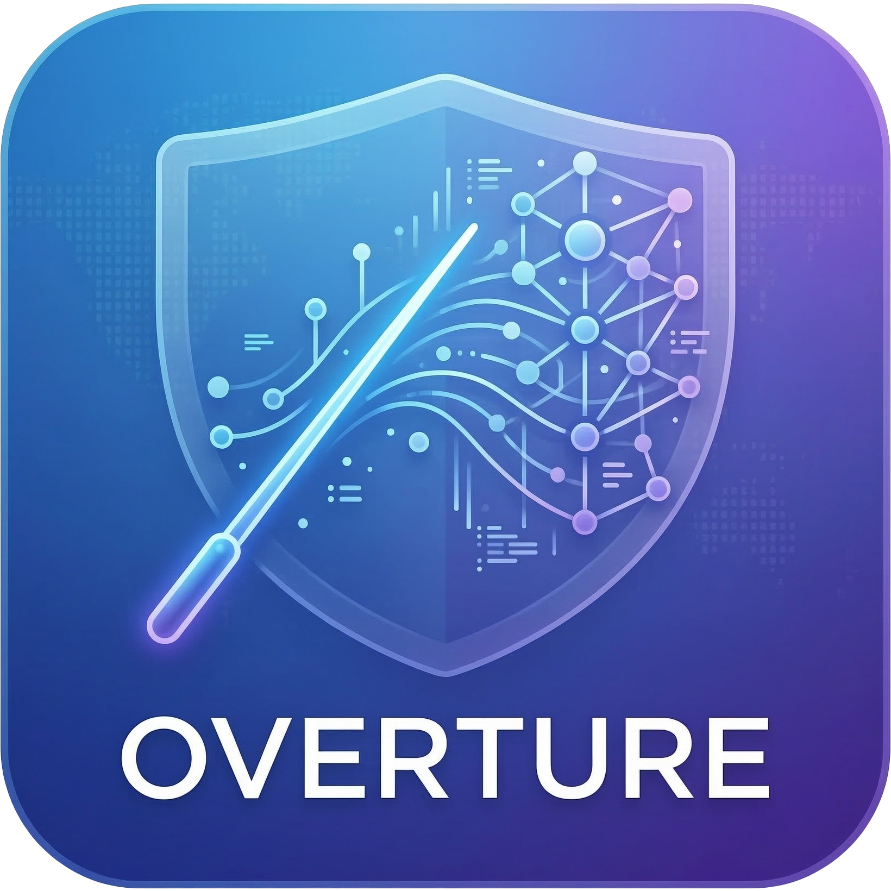

<p align="center">
  
</p>

# Overture

Overture is a local-first AI delivery control plane. It now supports two ways to start a project:

- the original quick path where you already have a finished `plan.md`
- a new guided pipeline that helps you shape the prompt, run deep research, review the generated plan, execute it with Symphony, launch the result locally, and then deploy it

The current app is a working Next.js control plane with SQLite persistence, real Codex-backed prompt/workshop and planning flows, vendored Symphony orchestration, artifact storage, gate tracking, mutable findings, per-project security review, launch/deploy runs, runtime observability, project deletion, and a settings area for model, research, and runtime defaults.

## What the platform does

- Ingests deep-research markdown plans
- Runs a guided six-stage flow: workshop, research, plan review, execution, launch, deploy
- Uses Codex App Server for a resumable prompt workshop with saved thread state
- Runs deep research separately from decomposition and keeps `plan.md` as the canonical handoff
- Uses Codex to produce a structured execution model
- Generates milestones, epics, dependency edges, findings, runs, artifacts, and audit events
- Injects mandatory QA, security, deployment, observability, documentation, and release gates
- Exposes a Linear-compatible tracker GraphQL surface for Symphony polling
- Launches Symphony against a per-project workflow contract
- Detects launch and deployment profiles from the target repository and records evidence for each supported run or publish path
- Tracks gate readiness, runtime state, artifacts, findings, and audit history in the UI
- Tracks both live-run token usage and the cumulative project token total across every run
- Supports hard deletion of failed or stale projects from the dashboard and project page
- Lets users choose planner and execution model defaults, research provider, and Codex thinking levels in `/settings`, with per-project overrides available in the intake flow

## Guided pipeline

Overture now supports this full lifecycle:

1. Prompt Workshop
2. Deep Research Run
3. Plan Review and Plan Ingestion
4. Symphony Execution
5. Launch Locally to Test
6. Deploy

If you upload or paste a source brief in the guided path, Overture stores it as a project artifact and uses it to seed the first workshop turn automatically.

The original quick path remains intact. If you already have a strong `plan.md`, you can still paste or upload it from the home page and go straight to plan ingestion and execution.

## Runtime model

There are two supported execution modes:

- `local_chatgpt`: uses the local Codex runtime already authenticated on the machine running Overture
- `hosted_api`: optional fallback mode that uses Codex with `OPENAI_API_KEY`

The automated local container deployment includes the Codex CLI, `git`, the Elixir runtime required by Symphony, and startup auth bootstrapping. On container startup, Overture copies the host machine's ChatGPT-backed Codex auth into the container's persisted `CODEX_HOME` under the platform runtime root so live planning and execution work without an extra login step.

Model selection works like this:

- If you leave the planner or execution model on `Codex default`, Overture lets the Codex CLI choose its default model
- If you want explicit control, set default model names in `/settings`
- If one project needs different model choices, open `Advanced project options` in the intake form and override them there

Thinking level works like this:

- Overture writes Codex `model_reasoning_effort` for both planning and Symphony ticket execution
- The settings page exposes dropdowns for `Low`, `Medium`, `High`, and `Extra High`
- `Extra High` is only offered for newer GPT-5 Codex-capable models; older selections automatically show the supported subset

Research-provider selection works like this:

- `codex_native` is the default local-first research provider
- `openai_responses` is the hosted/API fallback when `OPENAI_API_KEY` is available

## Stack

- Next.js 16 + React 19
- SQLite via `better-sqlite3`
- Zod for validation
- Custom control-plane UI on the App Router
- Vitest for unit coverage
- Playwright for end-to-end verification
- Semgrep, Trivy, and ZAP wrappers for security checks
- Vendored Symphony runtime under `vendor/symphony`

## Repository layout

- `src/app`: routes, pages, and API endpoints
- `src/components`: intake, workshop, research, dashboard, runtime, launch, deploy, and review UI
- `src/lib/server`: persistence, planner, workshop, research, tracker shim, Symphony manager, launch, deploy, storage, and repository logic
- `scripts`: seeding, runner entrypoint, and security wrappers
- `tests/e2e`: browser-level product tests
- `infra`: Azure, AWS, Jetson, and Raspberry Pi deployment assets and notes
- `vendor/symphony`: vendored Symphony runtime used for execution
- `plan.md`: sample source blueprint

## Prerequisites

- Node.js 22+
- npm
- Docker Desktop for local container deployment and ZAP
- A working Codex runtime for live planning and execution

Optional local binaries:

- `semgrep`
- `trivy`
- `mix` if you want to override the bundled Symphony build tool path

## Environment

Start from the shipped example:

```bash
cp .env.example .env
```

Common variables:

- `CONTROL_PLANE_TRACKER_TOKEN`: token accepted by the tracker shim
- `SYMPHONY_TRACKER_TOKEN`: token used by Symphony against the tracker shim
- `NEXT_PUBLIC_DEFAULT_REPO`: default repo source shown in intake. For local Docker deployment this should normally stay `.` so Overture targets the checked-out app workspace.
- `OPENAI_API_KEY`: optional; only needed if you intentionally use `hosted_api`
- `PORT`: app port
- `OVERTURE_BIND_HOST`: bind host for `npm run start`
- `OVERTURE_ROOT`: optional runtime data root override; defaults to `<repo>/.overture`
- `CODEX_HOME`: optional Codex auth/state home; Docker defaults this under `.overture`
- `OVERTURE_CODEX_BIN`: optional Codex CLI override
- `OVERTURE_MIX_BIN`: optional `mix` override for Symphony builds
- `OVERTURE_SYMPHONY_BIN`: optional Symphony binary override
- `OVERTURE_SYMPHONY_PORT_BASE`: base port used for per-project Symphony runtimes
- `OVERTURE_ORIGIN`: override origin used by the runner script
- `OVERTURE_INTERNAL_ORIGIN`: optional internal loopback origin used by Symphony when it talks back to the control plane

## Native quick start

Install dependencies:

```bash
npm install
```

Run the app in development:

```bash
npm run dev
```

Open [http://127.0.0.1:3000](http://127.0.0.1:3000).

For a production-style native launch:

```bash
npm run build
npm run start
```

This remains the simplest path for real project creation and execution when you want to use local ChatGPT-backed Codex auth.

## Local Docker quick start

This is the recommended production-like path on this machine because it automatically reuses your existing ChatGPT Codex login:

```bash
bash deploy.sh local
```

Then open [http://127.0.0.1:3000](http://127.0.0.1:3000).

What this does:

- Builds the Docker image with the Codex CLI and Symphony dependencies included
- Includes the Docker CLI and Compose plugin inside the app container for local docker-backed launch and deploy profiles
- Mounts your host Codex auth into the container
- Mounts the host Docker socket and host gateway so launch/deploy stages can manage sibling local stacks from inside the control plane
- Keeps project artifacts and runtime files under `.overture`
- Stores the live SQLite database and active Symphony workspaces in Docker-managed volumes instead of the macOS bind mount
- Migrates an existing host `.overture/data/overture.db*` into the Docker data volume on first launch
- Starts the app on port `3000`

Quick health check:

```bash
curl http://127.0.0.1:3000/api/health
```

## Cloud quick start

The Azure and AWS helpers now publish the current repo as a single-instance cloud control plane instead of leaving only placeholder baselines behind.

Azure:

```bash
AZURE_RESOURCE_GROUP=my-overture-rg OPENAI_API_KEY=sk-live-... bash deploy.sh azure
```

AWS:

```bash
AWS_REGION=us-west-2 OPENAI_API_KEY=sk-live-... bash deploy.sh aws
```

Cloud deploy behavior:

- Both targets inject `OPENAI_API_KEY` and force the product default execution mode to `hosted_api`
- Azure builds remotely in ACR; AWS builds locally with Docker buildx and pushes to ECR
- Both targets run Overture as a single container on a dedicated VM/EC2 host with persistent `.overture` state on the instance filesystem
- Both targets expose port `3000` directly and print `OVERTURE_APP_URL` plus `OVERTURE_HEALTHCHECK_URL` when the deploy completes
- Overture can publish these targets from the handoff flow, but release verification still treats final cloud validation as operator-owned

## Settings and model control

Open `/settings` in the UI to control:

- Default planner model from the built-in Codex model dropdown
- Default execution model from the built-in Codex model dropdown
- Default research provider
- Planning thinking level from the built-in Codex reasoning dropdown
- Agent thinking level from the built-in Codex reasoning dropdown
- Default execution mode
- Default repository source
- QA and security strictness defaults
- Symphony parallelism and max-turn limits

The shipped default for new projects is now `5` simultaneous Symphony agents.

These settings apply to new projects by default. Existing projects keep the planner/execution settings captured when they were created until you edit them from the project page under `Project settings and options`.

If you leave either model on `Codex default`, Overture lets the installed Codex CLI choose the runtime default. Otherwise you can pick from the current built-in Codex model catalog in the dropdown.

## Create and execute a project

You now have two supported starting paths.

### Guided path

Use this when you only have notes, a rough product idea, or an incomplete spec.

1. Open `/`.
2. In the guided card, enter a project name.
3. Paste notes or upload a source brief if you already have one.
4. Optionally adjust repo, model, or research defaults.
5. Click `Start guided project`.
6. If a source brief is present, Overture will use it to seed the first workshop turn automatically.
7. Use the workshop page to refine the prompt until it is ready.
8. Lock the prompt and run deep research.
9. Review and edit the generated `plan.md`.
10. Approve the plan and ingest it.
11. Start Symphony from the build view.
12. Use the `Launch` and `Deploy` pages to run later lifecycle stages.

### Quick path

Use this when you already have a finished `plan.md` or a strong markdown blueprint.

You can paste or upload a blueprint in the UI, or seed the sample `plan.md` from the command line:

```bash
npm run seed
```

That prints a project id. To launch Symphony for that project:

```bash
npm run runner -- <project-id>
```

The project page shows live Symphony runtime state, bootstrap logs, retry queues, tracker slices, artifacts, findings, and gate status.
It also shows both the current live-run token count and the total token count accumulated across all runs for that project.

## Run another project

For a fresh project run:

1. Delete the old project from the home dashboard or project page if you want a clean slate.
2. Open `/`.
3. Choose either the guided path or the quick path.
4. Give the project a name.
5. Start the next project.

You can also create a project programmatically with `POST /api/projects` in either `draft` or quick-path mode and then start execution with `POST /api/projects/:projectId/execute`.

## Delete a project

Project deletion is available in two places:

- The project dashboard cards on the home page
- The `Delete project` control on an individual project page

Deletion is a hard delete. It stops any active Symphony runtime for the project, removes the project row from SQLite, and deletes its runtime folders under `.overture/projects`, `.overture/artifacts`, and `.overture/workspaces`.

Equivalent API:

```text
DELETE /api/projects/:projectId
```

## Scripts

- `npm run dev`: Next.js development server
- `npm run build`: production build
- `npm run start`: standalone production server bound via `OVERTURE_BIND_HOST` and `PORT`
- `npm run seed`: ingest the repo `plan.md`
- `npm run runner -- <project-id>`: launch or reattach Symphony for a project
- `npm run lint`: ESLint
- `npm run test`: Vitest
- `npm run e2e`: Playwright against an isolated `.overture-e2e` runtime
- `npm run qa`: lint, unit tests, and production build
- `npm run security`: Semgrep and Trivy against the Overture repo itself
- `npm run security:zap`: ZAP baseline against a running Overture app
- `npm run deploy:local`: Docker Compose local deployment helper

Project-level security review is available from the project Overview tab. It writes per-project findings and evidence artifacts instead of scanning the control-plane repo globally. If Semgrep, Trivy, or ZAP cannot run, or if the workspace sample is truncated for a very large repo, Overture records the review as partial instead of silently passing the security gate.

Supported deployment helper targets:

- `bash deploy.sh local`
- `bash deploy.sh jetson`
- `bash deploy.sh raspberry_pi`
- `bash deploy.sh azure`
- `bash deploy.sh aws`
- `bash deploy.sh ios_testflight`
- `bash deploy.sh ios_app_store`

The Azure and AWS targets now provision real single-instance cloud hosts. Overture can publish them directly, but the release gate still remains partial until you validate the live cloud environment yourself.

## Verification flow

Recommended local verification:

```bash
npm run qa
npm run e2e
npm run security
ZAP_TARGET_URL=http://127.0.0.1:3000 npm run security:zap
npm audit --audit-level=high
```

For a fast manual smoke after launching the app:

1. Open `/`.
2. If needed, open `/settings` and confirm the default model, thinking level, and run mode.
3. Create or open a project.
4. Confirm the overview page shows the captured planning, agent, and run settings.
5. Start the automated run from the project page.
6. Verify `/api/health` returns `ok: true`.
7. Confirm the `Live run` tab shows either active work or a clear waiting explanation.

For a beginner end-to-end run in the UI with the new guided flow:

1. Open `/`.
2. Enter a project name.
3. Click `Start guided project`.
4. Use the workshop page until the prompt looks right.
5. Lock the prompt and run research.
6. Review the generated `plan.md`.
7. Approve the plan.
8. Start the automated run.
9. Use `Live run`, `Launch`, and `Deploy` as the project advances.

## Docker deployment

Bring up the containerized control plane:

```bash
npm run deploy:local
```

This requires a usable ChatGPT Codex login on the host machine. `deploy.sh local` exports that host auth directory into the container automatically.

The local Docker setup now:

- Builds the production image
- Installs the Codex CLI automatically
- Installs `git`, `curl`, the Docker CLI, and the Elixir runtime needed by Symphony
- Includes the vendored Symphony runtime
- Keeps host-visible artifacts and runtime files under `.overture`
- Moves the live SQLite database and active Symphony workspaces into Docker-managed volumes
- Persists Codex auth under `/app/.overture/codex-home`
- Copies host ChatGPT Codex auth into the container automatically
- Mounts `/var/run/docker.sock` and `host.docker.internal` so local docker launch/deploy profiles can orchestrate sibling stacks
- Exposes the app at [http://127.0.0.1:3000](http://127.0.0.1:3000)

Health check:

```bash
curl http://127.0.0.1:3000/api/health
```

If the host machine is not already logged into Codex, `deploy.sh local` now fails before startup and the container entrypoint also fails fast. A successful container boot means the required runtime dependencies and ChatGPT-backed Codex auth bootstrap path are present.

Target repositories can optionally define these repo-local healthcheck hints in `.env` or `.env.example` so Overture knows how to validate launch/deploy runs:

- `OVERTURE_LAUNCH_HEALTHCHECK_URL`
- `OVERTURE_DOCKER_HEALTHCHECK_URL`
- `OVERTURE_DEPLOY_HEALTHCHECK_URL`

## Runtime data

Default runtime directories:

- Native runs: `.overture/data/overture.db` is the canonical SQLite database
- Docker runs: the canonical SQLite database is stored in the `overture_data` Docker volume and imported from host `.overture/data/overture.db*` on first boot if present
- `.overture/artifacts`: immutable evidence files
- `.overture/codex-home`: persisted Codex CLI auth and local Codex state for containerized runs
- `.overture/projects`: per-project workflow contracts and Symphony runtime files
- Native runs: `.overture/workspaces` holds per-project cloned workspaces used by Symphony
- Docker runs: active Symphony workspaces live in the `overture_workspaces` Docker volume for stability
- `.overture-e2e`: isolated Playwright runtime root

`OVERTURE_ROOT` changes where `.overture` is created, but source resolution still points at the actual app repository root.

## Deployment assets

- `Dockerfile`: local production image
- `docker-compose.yml`: local container orchestration with shared host artifacts plus Docker-managed data/workspace volumes
- `deploy.sh`: helper for local, Jetson, Raspberry Pi, Azure, AWS, and iOS preparation entrypoints
- `infra/jetson/README.md`: Jetson deployment notes
- `infra/raspberry-pi/README.md`: Raspberry Pi deployment notes
- `infra/azure/main.bicep`: Azure baseline container-hosting asset
- `infra/aws/template.yaml`: AWS baseline infrastructure template

## API surface

- `GET /api/health`: health probe
- `GET /api/projects`: list project summaries
- `POST /api/projects`: create either a guided draft project or a quick-path project from spec content
- `POST /api/projects/drafts`: guided draft-project alias
- `DELETE /api/projects/:projectId`: hard-delete a project
- `PATCH /api/projects/:projectId`: rename a project
- `GET /api/projects/:projectId/snapshot`: fetch the full project snapshot
- `GET /api/projects/:projectId/artifacts`: list project artifacts
- `GET /api/projects/:projectId/workshop/thread`: fetch the current workshop thread and messages
- `POST /api/projects/:projectId/workshop`: send a workshop message or lock the prompt
- `POST /api/projects/:projectId/workshop/messages`: workshop-message alias
- `POST /api/projects/:projectId/workshop/fork`: create a fork of the current workshop thread
- `POST /api/projects/:projectId/research`: start deep research
- `POST /api/projects/:projectId/research/run`: deep-research alias
- `POST /api/projects/:projectId/research/approve`: approve the generated plan via the latest research artifact
- `POST /api/projects/:projectId/plan`: ingest an edited or generated `plan.md`
- `POST /api/projects/:projectId/plan/ingest`: plan-ingestion alias
- `POST /api/projects/:projectId/execute`: launch or refresh Symphony for the project
- `POST /api/projects/:projectId/launch`: run a launch profile
- `POST /api/projects/:projectId/launch/run`: launch alias
- `POST /api/projects/:projectId/deploy`: run a deploy profile
- `POST /api/projects/:projectId/deploy/run`: deploy alias
- `GET /api/settings`: read saved platform defaults
- `PATCH /api/settings`: update saved platform defaults
- `GET /api/artifacts/:artifactId`: stream a stored artifact
- `POST /api/tracker/graphql`: Linear-compatible tracker shim

## Security notes

- Artifact reads are boundary-checked before file access
- Security scans exclude vendored third-party runtime code from first-party policy failures
- The app ships response headers via `next.config.ts`
- The local Docker Compose deployment intentionally runs the container as `root` because the mounted Docker socket is the privilege boundary for local docker-backed launch and deploy profiles

## Current deployment reality

- Native host execution and Docker deployment are both wired for real operation
- Docker local deployment now installs and boots the required Codex and Symphony runtime dependencies automatically
- Jetson and Raspberry Pi deployment helpers are real SSH-driven ARM64 container rollouts once remote-host settings are provided
- Azure and AWS deployments are real baseline infrastructure flows, but they still depend on the target cloud credentials and image references you provide
